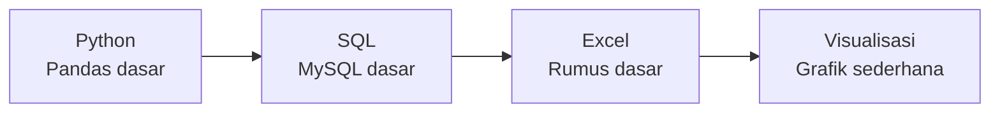

# **Jonathan Raditya | Calon Data Analyst**

  
### Siswa PKL | SMK Negeri 5 Surakarta
**Siap belajar dan berkontribusi dalam analisis data**

---

## 📊 **Keterampilan Teknis**

### **Bahasa & Teknologi**

### **Level Kemampuan**
<table>
<tr>
<td width="50%">

**Python Dasar**  
• Data cleaning sederhana dengan Pandas  
• Manipulasi data dasar  
• Membaca file CSV & Excel  
• Analisis eksplorasi sederhana

**SQL Dasar**  
• Query SELECT dengan WHERE  
• JOIN tabel sederhana  
• Aggregate functions (SUM, COUNT)  
• Filtering data

</td>
<td width="50%">

**Excel Dasar**  
• Pivot tables  
• Formula dasar (SUM, AVERAGE)  
• Membuat chart sederhana  
• Data validation dasar

**Visualisasi**  
• Line chart & bar chart  
• Pie chart  
• Basic formatting  
• Export gambar

</td>
</tr>
</table>

---

## 📈 **Portfolio Pembelajaran - 8 Minggu Progres**

### **Minggu 1: Pengenalan Python & Data**
| **Aspek** | **Detail** | **Keterangan** |
|-----------|------------|----------------|
| **Topik** | Python dasar untuk data | Variabel, tipe data, struktur data |
| **Tools** | Google Colab, Pandas | Environment setup |
| **Proyek** | Analisis data sederhana | Dataset kecil dengan 100 baris |
| **Output** | Cleaning data basic | Remove duplicates, handle missing |

### **Minggu 2: Data Cleaning dengan Pandas**
| **Aspek** | **Detail** | **Keterangan** |
|-----------|------------|----------------|
| **Topik** | Data cleaning techniques | Handling null values, formatting |
| **Tools** | Pandas, NumPy dasar | Data manipulation |
| **Proyek** | Cleaning dataset toko | Dataset penjualan bulanan |
| **Output** | Dataset clean siap analisis | CSV file terstruktur |

### **Minggu 3: SQL Fundamentals**
| **Aspek** | **Detail** | **Keterangan** |
|-----------|------------|----------------|
| **Topik** | Query dasar MySQL | SELECT, FROM, WHERE |
| **Tools** | MySQL Workbench | Database management |
| **Proyek** | Query data pelanggan | Database sederhana |
| **Output** | Laporan query results | Export ke CSV/Excel |

### **Minggu 4: SQL Lanjutan & JOINs**
| **Aspek** | **Detail** | **Keterangan** |
|-----------|------------|----------------|
| **Topik** | JOIN operations | INNER, LEFT, RIGHT JOIN |
| **Tools** | MySQL, Python connector | Integration basics |
| **Proyek** | Multi-table analysis | Join 2-3 tabel relasional |
| **Output** | Combined dataset | Data dari multiple sources |

### **Minggu 5: Visualisasi Data Dasar**
| **Aspek** | **Detail** | **Keterangan** |
|-----------|------------|----------------|
| **Topik** | Matplotlib dasar | Line, bar, pie charts |
| **Tools** | Matplotlib, Jupyter | Visualization setup |
| **Proyek** | Sales dashboard | Monthly trends visualization |
| **Output** | Grafik statis | PNG/JPEG exports |

### **Minggu 6: Excel untuk Analisis**
| **Aspek** | **Detail** | **Keterangan** |
|-----------|------------|----------------|
| **Topik** | Excel formulas & pivot | SUMIF, VLOOKUP dasar |
| **Tools** | Excel/Google Sheets | Spreadsheet analysis |
| **Proyek** | Financial report | Simple budgeting analysis |
| **Output** | Pivot tables & charts | Interactive Excel file |

### **Minggu 7: Integrated Project**
| **Aspek** | **Detail** | **Keterangan** |
|-----------|------------|----------------|
| **Topik** | End-to-end simple analysis | Full workflow |
| **Tools** | Python, SQL, Excel | Multi-tool integration |
| **Proyek** | Product performance analysis | E-commerce dataset |
| **Output** | Comprehensive report | Analysis + visualization |

### **Minggu 8: Capstone Project**
| **Aspek** | **Detail** | **Keterangan** |
|-----------|------------|----------------|
| **Topik** | Complete data analysis | All skills combined |
| **Tools** | Full stack dasar | Python, SQL, Excel, Git |
| **Proyek** | Business case analysis | Realistic scenario |
| **Output** | Portfolio project | GitHub repository complete |

### **Repositori GitHub**

 

---

## 🎓 **Profil Pendidikan**

**SMK NEGERI 5 SURAKARTA**
*Teknik Komputer dan Jaringan*
*Kelas XII - Siswa Aktif*

---

## 💼 **Kesiapan PKL**

### **Apa yang Bisa Saya Bantu:**
1. **Data Preparation**: Cleaning dan organizing data sederhana
2. **Basic Analysis**: Analisis statistik dasar
3. **Reporting**: Membuat laporan dengan visualisasi sederhana
4. **Documentation**: Mendokumentasikan proses analisis

### **Ekspektasi Saya:**
- Pembelajaran langsung dari praktisi
- Bimbingan dalam menyelesaikan tugas
- Pengalaman dengan data dan tools industri

---

## ✨ **Nilai Tambah**

<table>
<tr>
<td width="50%">

### **Keunggulan**
- 🔍 **Teliti** dalam data cleaning
- 📚 **Mau belajar** tools dan teknik baru
- 🤝 **Bisa bekerja sama** dalam tim
- 📊 **Rapi** dalam dokumentasi

</td>
<td width="50%">

### **Siap Untuk**
- ✅ Tugas analisis data dasar
- ✅ Proyek dengan bimbingan
- ✅ Belajar sambil bekerja
- ✅ Berkontribusi dalam tim

</td>
</tr>
</table>

---

## 📞 **Kontak & Koneksi**

### **Hubungi Saya**
📧 **Email**: email@example.com  
💼 **GitHub**: [github.com/username](https://github.com/username)  
📍 **Lokasi**: Surakarta, Jawa Tengah

---

### **"Siswa yang antusias belajar analisis data, mencari kesempatan PKL untuk belajar langsung dari praktisi."**

---
