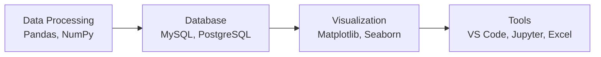

# **Jonathan Raditya | Calon Data Analyst**

  
### Siswa PKL | SMK Negeri 5 Surakarta
**Siap belajar dan berkontribusi dalam analisis data**

---

## 📊 **Keterampilan Teknis**

### **Bahasa & Teknologi**

### **Level Kemampuan**
<table>
<tr>
<td width="50%">

**Data Processing**  
• Data cleaning & preprocessing  
• Data transformation & manipulation  
• Exploratory data analysis  
• File handling (CSV, Excel, JSON)

**Database & Querying**  
• SQL fundamentals & queries  
• Database design basics  
• Data extraction & filtering  
• Aggregate operations

</td>
<td width="50%">

**Data Visualization**  
• Basic charts & graphs  
• Statistical visualizations  
• Dashboard creation  
• Report generation

**Development Environment**  
• Python development setup  
• Version control with Git  
• Collaborative coding  
• Documentation practices

</td>
</tr>
</table>

---

## 📈 **Portfolio Pembelajaran**

### **Progres 8 Minggu Belajar Mandiri**

| **Minggu** | **Fokus Pembelajaran** | **Proyek Contoh** | **Status** | **Kompetensi** |
|------------|-----------------------|-------------------|------------|----------------|
| **1-2** | Fundamental Data Processing | Data cleaning retail dataset | ✅ | Cleaning, transformation |
| **3-4** | Database Fundamentals | Customer data analysis | ✅ | Query, filtering, joins |
| **5-6** | Data Visualization | Monthly sales dashboard | ✅ | Charts, reporting |
| **7-8** | Integrated Analysis | E-commerce analysis project | ✅ | End-to-end workflow |

### **Repositori GitHub**

<table>
<tr>
<td align="center">

**Data Fundamentals**
 

</td>
<td align="center">

**Visualization & Analysis**
 

</td>
</tr>
<tr>
<td align="center">

**Project Work**
 

</td>
<td align="center">

**Advanced Applications**
 

</td>
</tr>
</table>

---

## 🎓 **Profil Pendidikan**

### **SMK NEGERI 5 SURAKARTA**
**Teknik Komputer dan Jaringan**  
*Kelas XII - Siswa Aktif*

**Kurikulum Relevan:**
• Dasar Pemrograman • Manajemen Database • Sistem Informasi • Jaringan Komputer

---

## 💼 **Kesiapan PKL**

### **Apa yang Bisa Saya Bantu:**
<table>
<tr>
<td width="50%">

**🎯 Technical Tasks**
1. **Data Preparation**  
   Cleaning & organizing datasets

2. **Basic Analysis**  
   Statistical analysis & insights

3. **Reporting**  
   Create reports with visualizations

4. **Documentation**  
   Process & methodology documentation

</td>
<td width="50%">

**🛠️ Tools Application**
• **Python**: Data processing automation  
• **SQL**: Database querying & extraction  
• **Excel**: Quick analysis & reporting  
• **Git**: Version control & collaboration

</td>
</tr>
</table>

### **Ekspektasi Saya:**

• **Direct learning** from experienced practitioners  
• **Structured guidance** in completing tasks  
• **Hands-on experience** with industry data and tools  
• **Constructive feedback** for skill development

---

## ✨ **Nilai Tambah**

<table>
<tr>
<td width="50%" style="vertical-align: top;">

### **Personal Strengths**

✅ **Detail-oriented**  
   *Meticulous in data checking and analysis*

✅ **Fast Learner**  
   *Quick to master new tools and techniques*

✅ **Collaborative**  
   *Open to feedback and teamwork*

✅ **Structured**  
   *Neat and well-documented work*

</td>
<td width="50%" style="vertical-align: top;">

### **Ready For**

🎯 **Basic data analysis tasks**  
   *With minimal guidance*

🎯 **Structured projects**  
   *With clear timelines*

🎯 **Learning on the job**  
   *While actively contributing*

🎯 **Team contribution**  
   *As part of a data team*

</td>
</tr>
</table>

---

## 📞 **Kontak & Koneksi**

### **Hubungi Saya**

<table style="margin: 0 auto; color: white;">
<tr>
<td align="center" width="33%">

📧 **Email**  
<small>email@example.com</small>

</td>
<td align="center" width="33%">

💼 **GitHub**  
<small>[github.com/username](https://github.com/username)</small>

</td>
<td align="center" width="33%">

📍 **Lokasi**  
<small>Surakarta, Jawa Tengah</small>

</td>
</tr>
</table>

---

