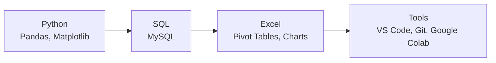

# **Jonathan Raditya | Calon Data Analyst**

  
### Siswa PKL | SMK Negeri 5 Surakarta
**Siap belajar dan berkontribusi dalam analisis data**

---

## 📊 **Keterampilan Teknis**

### **Bahasa & Teknologi**

### **Level Kemampuan**
<table>
<tr>
<td width="50%">

**Python & Pandas**  
• Data cleaning & preprocessing  
• Data transformation  
• Analisis eksplorasi dasar  
• File handling (CSV, Excel)

**SQL & Database**  
• Query dasar (SELECT, WHERE, JOIN)  
• Filtering & sorting data  
• Aggregate functions  
• MySQL Workbench

</td>
<td width="50%">

**Excel & Spreadsheets**  
• Pivot tables & pivot charts  
• Formulas dasar (VLOOKUP, SUMIF)  
• Data validation  
• Chart creation

**Development Tools**  
• VS Code dengan ekstensi Python  
• Git & GitHub untuk version control  
• Google Colab untuk kolaborasi

</td>
</tr>
</table>

---

## 📈 **Portfolio Pembelajaran**

### **Progres 8 Minggu Belajar Mandiri**

| **Minggu** | **Fokus Pembelajaran** | **Proyek Contoh** | **Status** | **Kompetensi** |
|------------|-----------------------|-------------------|------------|----------------|
| **1-2** | Fundamental Python & Pandas | Data cleaning dataset toko retail | ✅ | Cleaning, transformation |
| **3-4** | SQL Dasar & Query | Analisis data pelanggan perusahaan | ✅ | Query, filtering, joins |
| **5-6** | Visualisasi Data | Dashboard penjualan bulanan | ✅ | Matplotlib, charts |
| **7-8** | Proyek Integrasi | Analisis e-commerce lengkap | ✅ | End-to-end analysis |

### **Repositori GitHub**

<table>
<tr>
<td align="center">

**Fundamental Skills**
 

</td>
<td align="center">

**Visualization**
 

</td>
</tr>
<tr>
<td align="center">

**Analysis Projects**
 

</td>
<td align="center">

**Advanced Projects**
 

</td>
</tr>
</table>

---

## 🎓 **Profil Pendidikan**

### **SMK NEGERI 5 SURAKARTA**
**Teknik Komputer dan Jaringan**  
*Kelas XII - Siswa Aktif (Lulus 2024)*

**Kurikulum Relevan:**
• Pemrograman Dasar • Database Management • Sistem Informasi • Jaringan Komputer

---

## 💼 **Kesiapan PKL**

### **Apa yang Bisa Saya Bantu:**
<table>
<tr>
<td width="50%">

**🎯 Tugas Teknis**
1. **Data Preparation**  
   Cleaning & organizing messy datasets

2. **Basic Analysis**  
   Statistical analysis & insights generation

3. **Reporting**  
   Create reports with visualizations

4. **Documentation**  
   Process & methodology documentation

</td>
<td width="50%">

**🛠️ Tools Application**
• **Python**: Automated data processing  
• **SQL**: Database querying & extraction  
• **Excel**: Quick analysis & reporting  
• **Git**: Version control & collaboration

</td>
</tr>
</table>

### **Ekspektasi Saya:**

• **Pembelajaran langsung** dari praktisi berpengalaman  
• **Bimbingan terstruktur** dalam menyelesaikan tugas  
• **Pengalaman hands-on** dengan data dan tools industri  
• **Feedback konstruktif** untuk pengembangan skill

---

## ✨ **Nilai Tambah**

<table>
<tr>
<td width="50%" style="vertical-align: top;">

### **Keunggulan Pribadi**

✅ **Detail-oriented**  
   *Teliti dalam pemeriksaan data dan analisis*

✅ **Fast Learner**  
   *Cepat menguasai tools dan teknik baru*

✅ **Collaborative**  
   *Terbuka untuk feedback dan kerja tim*

✅ **Structured**  
   *Kerja rapi dan terdokumentasi dengan baik*

</td>
<td width="50%" style="vertical-align: top;">

### **Siap Untuk**

🎯 **Tugas analisis data dasar**  
   *Dengan bimbingan minimal*

🎯 **Proyek terstruktur**  
   *Dengan timeline yang jelas*

🎯 **Learning on the job**  
   *Sambil berkontribusi aktif*

🎯 **Team contribution**  
   *Sebagai bagian dari tim data*

</td>
</tr>
</table>

---

## 📞 **Kontak & Koneksi**

### **Hubungi Saya**

<table style="margin: 0 auto; color: white;">
<tr>
<td align="center" width="33%">

📧 **Email**  
<small>email@example.com</small>

</td>
<td align="center" width="33%">

💼 **GitHub**  
<small>[github.com/username](https://github.com/username)</small>

</td>
<td align="center" width="33%">

📍 **Lokasi**  
<small>Surakarta, Jawa Tengah</small>

</td>
</tr>
</table>

---

### **"Antusias belajar, siap berkontribusi, dan berkomitmen untuk berkembang dalam bidang data analysis."**

**Portofolio lengkap tersedia untuk review teknis:**  
[https://github.com/username](https://github.com/username)

---

*Dokumen ini dibuat dengan representasi akurat tentang kemampuan dan kesiapan sebagai siswa PKL.*  
*Updated: March 2024*

