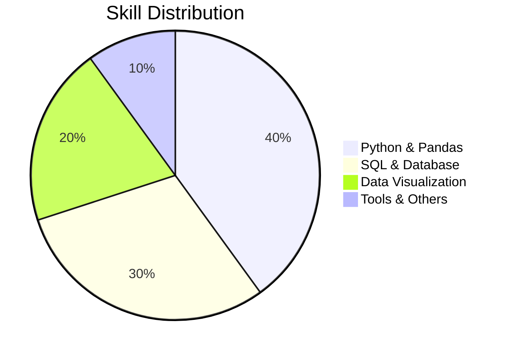
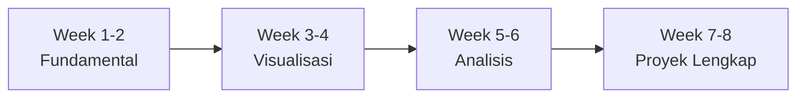
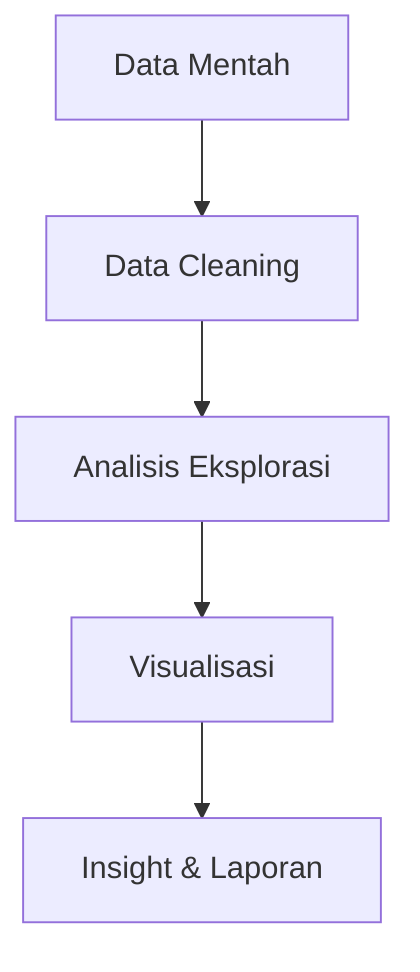

# **Jonathan Raditya | Calon Data Analyst**  
**Siswa PKL SMK Negeri 5 Surakarta**  

<div align="center">
  
✨ *Belajar Data dengan Semangat* ✨

</div>

---

## 📊 **Keterampilan yang Sudah Dikuasai**



### **Dasar-dasar (Siap Pakai untuk Tugas Sederhana):**
- **Python**: Cleaning data dengan Pandas, visualisasi sederhana dengan Matplotlib
- **SQL**: Query dasar (SELECT, WHERE, JOIN, GROUP BY), praktek dengan MySQL
- **Excel**: Pivot table, formula dasar, chart sederhana
- **Tools**: VS Code, Google Colab, Git untuk version control

---

## 📁 **Portfolio - Perkembangan Belajar 8 Minggu**

<div align="center">
  
| Minggu | Progres | Status | Repo |
|--------|---------|---------|------|
| Week 1 | ✅ | Selesai | [🔗](https://github.com/username/week1) |
| Week 2 | ✅ | Selesai | [🔗](https://github.com/username/week2) |
| Week 3 | ✅ | Selesai | [🔗](https://github.com/username/week3) |
| Week 4 | ✅ | Selesai | [🔗](https://github.com/username/week4) |
| Week 5 | ✅ | Selesai | [🔗](https://github.com/username/week5) |
| Week 6 | ✅ | Selesai | [🔗](https://github.com/username/week6) |
| Week 7 | ✅ | Selesai | [🔗](https://github.com/username/week7) |
| Week 8 | ✅ | Selesai | [🔗](https://github.com/username/week8) |

</div>

---

## 📈 **Progres Belajar**



---

## 🎯 **Yang Sudah Dipelajari**

<details>
<summary><b>📌 Klik untuk lihat detail</b></summary>

```python
# Contoh sederhana dari apa yang sudah dipelajari
import pandas as pd
import matplotlib.pyplot as plt

# Load data
data = pd.read_csv('data.csv')

# Cleaning sederhana
data_clean = data.dropna()

# Visualisasi
plt.figure(figsize=(10,5))
plt.plot(data_clean['tanggal'], data_clean['penjualan'])
plt.title('Trend Penjualan')
plt.show()
```

</details>

---

## 🌟 **Proyek Contoh**

<div align="center">



</div>

---

## 📞 **Kontak**

<div align="center">

📧 **Email**: email@example.com  
🐱 **GitHub**: [github.com/username](https://github.com/username)  
📍 **Lokasi**: Surakarta, Jawa Tengah

</div>

---

<div align="center">

### 🔄 **Siap belajar dan berkembang!** 🔄

</div>

---

**Catatan**: Untuk melihat animasi dan diagram interaktif, lihat versi online atau gunakan viewer yang mendukung MermaidJS dan animasi CSS.

---

<style>
/* Animasi sederhana */
@keyframes fadeIn {
  from { opacity: 0; }
  to { opacity: 1; }
}

@keyframes slideIn {
  from { transform: translateY(20px); opacity: 0; }
  to { transform: translateY(0); opacity: 1; }
}

/* Terapkan animasi */
h1, h2, h3 {
  animation: fadeIn 1s ease-in;
}

table {
  animation: slideIn 0.8s ease-out;
}

/* Efek hover pada tabel */
table tr:hover {
  background-color: #f5f5f5;
  transition: background-color 0.3s;
}

/* Loading animation untuk diagram */
mermaid {
  animation: fadeIn 1.5s ease-in;
}

/* Pulsing effect untuk kontak */
div[align="center"]:last-child {
  animation: pulse 2s infinite;
}

@keyframes pulse {
  0% { opacity: 1; }
  50% { opacity: 0.8; }
  100% { opacity: 1; }
}
</style>

<script src="https://cdn.jsdelivr.net/npm/mermaid@10.6.1/dist/mermaid.min.js"></script>
<script>
  mermaid.initialize({
    startOnLoad: true,
    theme: 'neutral',
    securityLevel: 'loose'
  });
</script>
