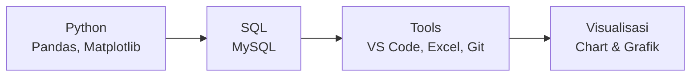

# **Jonathan Raditya | Calon Data Analyst**

  
### Siswa PKL | SMK Negeri 5 Surakarta
**Siap belajar dan berkontribusi dalam analisis data**

---

## 📊 **Keterampilan Teknis**

### **Bahasa & Teknologi**

### **Level Kemampuan**
- **Python & Pandas**: Data cleaning, transformasi, analisis dasar
- **SQL**: Query data, filtering, aggregation sederhana
- **Excel**: Formula dasar, pivot tables, charting
- **Git**: Version control untuk dokumentasi kode

---

## 📈 **Portfolio Pembelajaran**

### **Progres 8 Minggu Belajar Mandiri**
| Minggu | Fokus Pembelajaran | Proyek Contoh | Status |
|--------|-------------------|---------------|---------|
| **1-2** | Fundamental Python & Pandas | Data cleaning dataset sederhana | ✅ |
| **3-4** | SQL Dasar & Query | Analisis data pelanggan | ✅ |
| **5-6** | Visualisasi Data | Dashboard penjualan bulanan | ✅ |
| **7-8** | Proyek Integrasi | Analisis e-commerce lengkap | ✅ |

### **Repositori GitHub**

---

## 🎓 **Profil Pendidikan**

**SMK NEGERI 5 SURAKARTA**
*Teknik Komputer dan Jaringan*
*Kelas XII - Siswa Aktif*

---

## 💼 **Kesiapan PKL**

### **Apa yang Bisa Saya Bantu:**
1. **Data Preparation**: Cleaning dan organizing data
2. **Basic Analysis**: Analisis statistik sederhana
3. **Reporting**: Membuat laporan dengan visualisasi
4. **Documentation**: Mendokumentasikan proses analisis

### **Ekspektasi Saya:**
- Pembelajaran langsung dari praktisi
- Bimbingan dalam menyelesaikan tugas
- Pengalaman dengan data dan tools industri

---

## ✨ **Nilai Tambah**

<table>
<tr>
<td width="50%">

### **Keunggulan**
- 🔍 **Detail-oriented** dalam data cleaning
- 📚 **Cepat belajar** tools dan teknik baru
- 🤝 **Kolaboratif** dan terbuka untuk feedback
- 📊 **Struktur kerja** yang rapi dan terdokumentasi

</td>
<td width="50%">

### **Siap Untuk**
- ✅ Tugas analisis data dasar
- ✅ Proyek dengan bimbingan
- ✅ Learning on the job
- ✅ Berkontribusi dalam tim

</td>
</tr>
</table>

---

## 📞 **Kontak & Koneksi**

### **Hubungi Saya**
📧 **Email**: email@example.com  
💼 **GitHub**: [github.com/username](https://github.com/username)  
📍 **Lokasi**: Surakarta, Jawa Tengah

---

### **"Antusias belajar, siap berkontribusi, dan ingin berkembang di bidang data analysis."**

---

